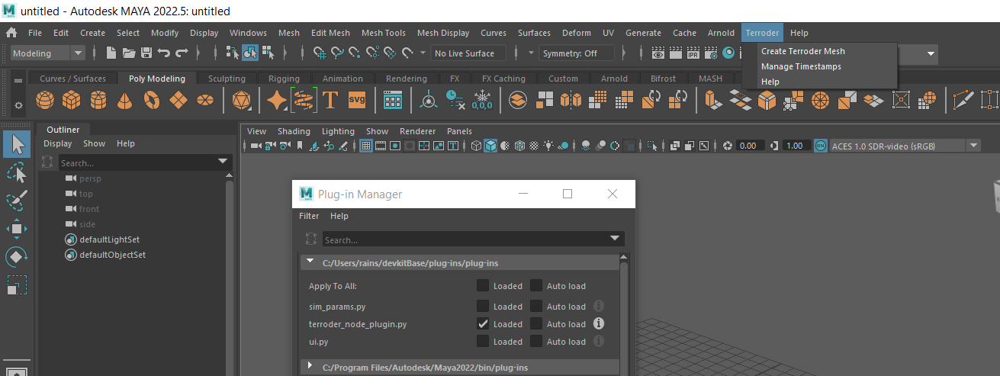
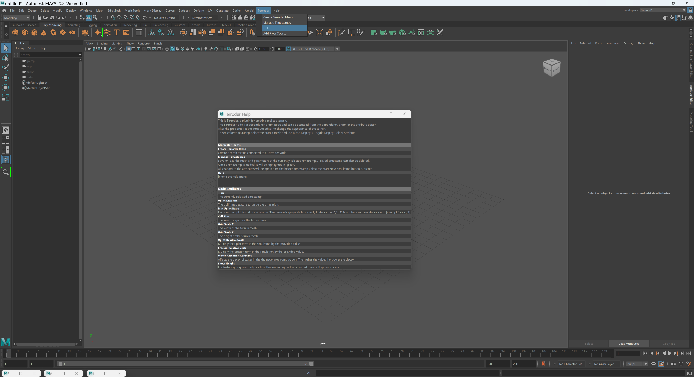
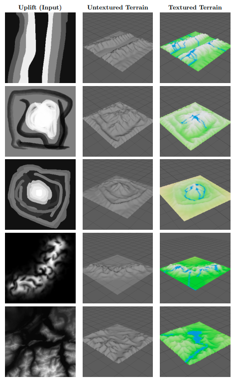
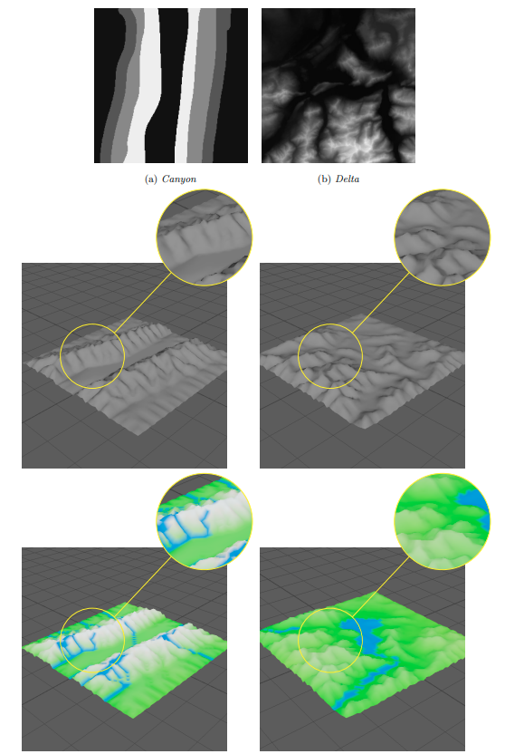

## About
_Terroder_ is a terrain creation plugin that creates realistic terrain from a low-resolution "uplift" texture.

Written by Andrew Ding and Xinran Tao for UPenn's CIS6600 in spring 2024.

## Usage
- Install Maya, or have it installed.
- Install the following dependency packages:
    - packages: 
        - numpy
        - pillow
        - opencv-python
    - These packages must be installed for the mayapy executable, e.g. navigate to the folder with mayapy and execute: ```mayapy -m pip install <flags> <package>```
        - default (no specified) flags should work for all packages
    - For more detailed instructions on installing Python packages for Maya plugins, see [this page on Autodesk's website](https://help.autodesk.com/view/MAYAUL/2024/ENU/?guid=GUID-72A245EC-CDB4-46AB-BEE0-4BBBF9791627).
- Copy ```terroder_node_plugin.py``` to an appropriate folder, and use Maya's plugin manager to load it as a python plugin. The singular file is the entire plugin.
- The plugin creates a new top-level menu, as seen below:

- One of the items in the _Terroder_ menu provides a help dialog:

- Use the _Create_ _Terroder_ _Mesh_ option to get started.

## Example Output
The following table shows typical results. From left to right in each row: the uplift texture, the untextured output terrain mesh, the (approximately) textured output terrain mesh.


Zooming into specific areas of the output mesh, we can see that it's quite detailed.

